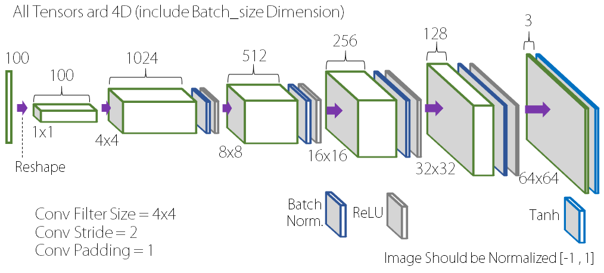
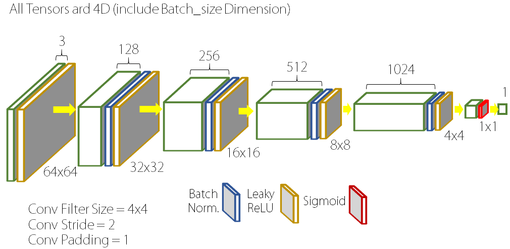
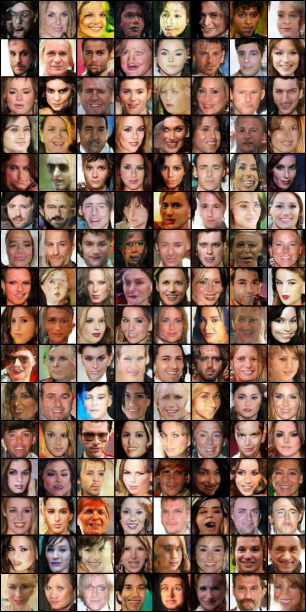
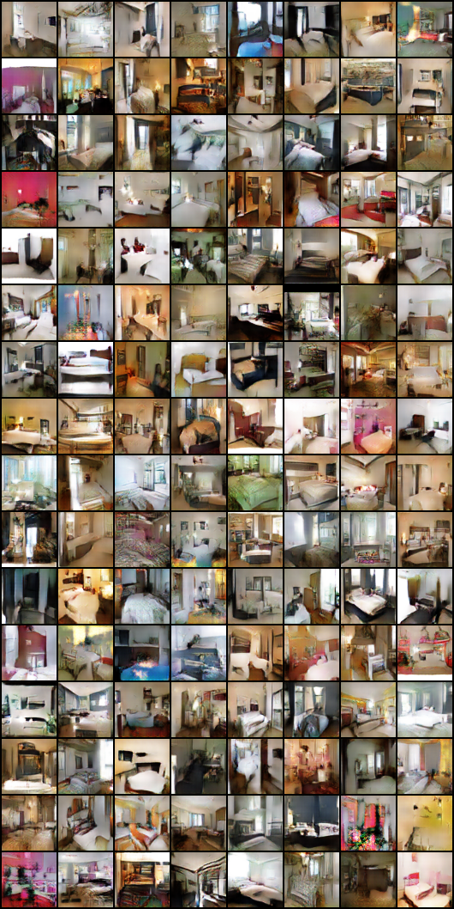

# DCGAN in Pytorch

Basic Implementation (Study friendly) of DCGAN in Pytorch

More Information: [Original Paper](https://arxiv.org/abs/1511.06434)

Identical Tensorflow Implemenation is on the [HyeongminLEE's Github](https://github.com/HyeongminLEE/Tensorflow_DCGAN)

- GAN: [[Pytorch](https://github.com/taeoh-kim/GANin50lines)][[Tensorflow](https://github.com/HyeongminLEE/GANin50lines)]
- DCGAN: [[Pytorch](https://github.com/taeoh-kim/Pytorch_DCGAN)][[Tensorflow](https://github.com/HyeongminLEE/Tensorflow_DCGAN)]
- InfoGAN: [[Pytorch](https://github.com/taeoh-kim/Pytorch_InfoGAN)][Tensorflow]
- Pix2Pix: [[Pytorch](https://github.com/taeoh-kim/Pytorch_Pix2Pix)][[Tensorflow](https://github.com/HyeongminLEE/Tensorflow_Pix2Pix)]
- DiscoGAN: [[Pytorch](https://github.com/taeoh-kim/Pytorch_DiscoGAN)][[Tensorflow](https://github.com/HyeongminLEE/Tensorflow_DiscoGAN)]

## 1. Environments

- Ubuntu 16.04
- Python 3.6 (Anaconda)
- Pytorch 0.2.0
- Torchvision 0.1.9
- lmdb (pip install lmdb): for LSUN Dataset

## 2. Networks and Parameters

### 2.1 Hyper-Parameters

- Image Size = 64x64 (Both in CelebA and LSUN-Bedroom)
- Batch Size = 128 (~32 is OK)
- Learning Rate = 0.0002
- Adam_beta1 = 0.5
- z_dim = 100
- Epoch = 5 in CelebA is Enough, 1 in LSUN is Enough. Sometimes it can be diverge.

### 2.2 Generator Networks (network.py)

<p align="center"></p>

### 2.3 Discriminator Networks (network.py)

<p align="center"></p>

## 3. Run (Train)

You can modify hyper-parameter. Look at the parsing part of the code.

### 3. 1 CelebA DB (Cropped Face, 156253 Samples)

Data Download

```bash
chmod +x celebdownload.sh
./celebdownload.sh
```

Train

```bash
python dcgan.py
```

### 3. 2 LSUN-Bedroom DB (3033042 Samples)

Data Download

```bash
python lsun.py -c bedroom
```

After download, unzip.

Train

```bash
python dcgan.py --db 'lsun'
```

## 4. Test

After finish training, saved model will be in the `./models` directory.

```bash
$ python dcgan_test.py 
```

Parameter

- `image_size` & `z_dim` must be same with training
- `sample_size`: Test sample size
- `num_epochs`: Which model will be used for test

Test results will be saved in `./test_result`

## 5. Results

DCGAN with CelebA (5 Epochs)

<p align="center"></p>

DCGAN with LSUN (1 Epochs)

<p align="center"></p>


